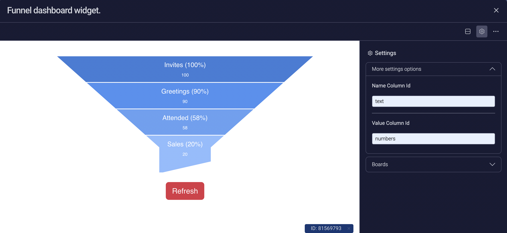

# Overview

This is a Funnel Widget monday app.

It can connect to a dashboard and display its data in a funnel chart. Eg- Sales Funnel Chart

## Run the project

In the project directory, you should run:

### `npm install`

And then to run an application with automatic virtual ngrok tunnel, run:

### `npm start`

Visit <http://localhost:4040/status> and under "command_line section" find the URL. This is the public URL of your app, so you can use it to test it.
F.e.: <https://021eb6330099.ngrok.io>

## Configure Monday App

1. Open monday.com, login to your account and go to a "Developers" section.
2. Create a new "My App"
3. Open "OAuth & Permissions" section and add "boards:read" scope
4. Open "Features" section and create a new "Boards View" feature
5. Open "View setup" tab and fulfill in "Custom URL" field your ngrok public URL, which you got previously (f.e. <https://021eb6330099.ngrok.io>)
6. Click "Boards" button and choose one of the boards with some data in it.
7. Click "Preview button"

## Release

1. Run script `npm run build`
2. Zip your "./build" folder
3. Open "Build" tab in your Feature
4. Click "New Build" button
5. Click "Upload" radio button and upload zip file with your build
6. Go to any board and add your just released view

## Usage

This section shows you how to use this widget.

1. Click on **more option** on the top right of the widget and go to settings.

2. Enter the Column IDs of the columns you want to display on funnel chart.

- ***Name Column Id*** should be the the column id of text column.

- ***Value Column Id*** should be the column id of numbers column.

 

And that's it, you are done. The funnel widget should now display your data.
